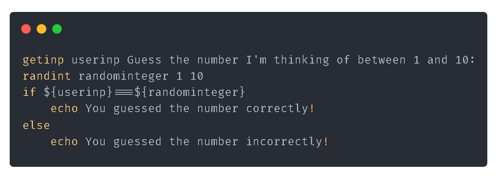

# ZIO+ Documentation

- [ZIO+ Documentation](#zio-documentation)
  - [Updates!](#updates)
  - [📁 How to install](#-how-to-install)
    - [How to clone repository?](#how-to-clone-repository)
    - [Click to open project with Gihtub Desktop](#click-to-open-project-with-gihtub-desktop)
    - [Install requirements](#install-requirements)
  - [❔ How to use](#-how-to-use)
    - [⚙ How can i run ZIO+ code](#-how-can-i-run-zio-code)
  - [📝 How to write .zi code](#-how-to-write-zi-code)
  - [Keys](#keys)
    - [comments](#comments)
    - [define](#define)
    - [math](#math)
    - [randint](#randint)
    - [getinp](#getinp)
    - [if](#if)
    - [else](#else)
    - [point](#point)
    - [break](#break)
  - [Commands](#commands)
    - [echo](#echo)
  - [delay](#delay)
    - [goto](#goto)
    - [quit](#quit)
  - [Library System](#library-system)
    - [📦 Install library](#-install-library)
    - [🗳 Create library](#-create-library)
    - [Example Code: Number guessing game](#example-code-number-guessing-game)

## Updates!
1) **Added `point` key and `goto` command. [GO point](#point) or [GO goto](#goto)**
2) **Added `break` key for point and goto keys. [GO!](#break)**

## 📁 How to install
Sorry I couldn't turn the project into an Executable file but you can clone repository and run it in your terminal.
You can download the latest version of ZIO+ from [here](https://www.github.com/sanalzio/ZIO-Plus/archive/refs/heads/master.zip)
or clone repository for install
### How to clone repository?
1) Open terminal or git bash in your folder where you want to save the project
2) Use this command:
    ```bash
    git clone https://github.com/sanalzio/ZIO-Plus.git
    ```
or open with Github Desktop
### [Click to open project with Gihtub Desktop](x-github-client://openRepo/https://github.com/sanalzio/ZIO-Plus)

### Install requirements

1) Open terminal in your folder where you want to save the project.
2) If Node.js is not installed on your computer, please install it.
3) Use this command for install requirements:

    ```bash
    npm intall
    ```

## ❔ How to use
You can write zio+ code on any text editor.
### ⚙ How can i run ZIO+ code
1) Open terminal in your folder where you want to save the project.
2) And use this command for run .zi code:

    ```bash
    node index.js <.zi file path>
    ```

## 📝 How to write .zi code
1) Create new text file and chage extesion to .zi
2) And edit file content

## Keys
**Keys are executed before functions, allowing keywords like 'if' and 'else' to work smoothly.**

### comments
```bash
// This is a comment.
echo ZIO+ // Or this is a comment.
```

### define
```bash
define variable 123
echo ${variable}
```

### math
```bash
define variable 123
echo $[${variable}+5] // Output: 128
```

### randint
```bash
randint randominteger 1 10
echo ${randominteger}
```

### getinp
```bash
getinp input
getinp inpwithtext What shall I say?
echo ${input}
echo ${inpwithtext}
```
### if
```bash
define variablename just simple string
if "just string"=="${variablename}"
    echo True!
```
**! Warning:** If a string is going to pass within the condition in if blocks, the string should be enclosed in double quotes ("")

### else
```bash
define variablename just simple string
if "just string"=="${variablename}"
    echo True!
else
    echo False!
```

### point
```bash
point x
echo Loop!
goto x
```

### break
```bash
define integer 0
point looppoint
delay 1000
echo ${integer}
define integer $[${integer}+1]
if ${integer}>=3
    break
goto looppoint
```

## Commands
### echo
```bash
echo Hello World
```

## delay
`delay <miliseconds>`
```bash
delay 5000
```

### goto
```bash
point x
echo Loop!
goto x
```

### quit
```bash
quit
```

## Library System
Library system is a way to manage your scripts and libraries. You can use it like this:
### 📦 Install library
```bash
node index.js i sanalzio.example-ZIO-Plus-library.master
```
`github_user.user_repository.branch_or_tag`

### 🗳 Create library
You can see [example library repository](https://www.github.com/sanalzio/example-ZIO-Plus-library).

[](https://www.github.com/sanalzio/example-ZIO-Plus-library)

### Example Code: Number guessing game
[**Code in GitHub**](https://github.com/sanalzio/ZIO-Plus/blob/master/example.zi)

[**Raw Code**](https://raw.githubusercontent.com/sanalzio/ZIO-Plus/master/example.zi)

